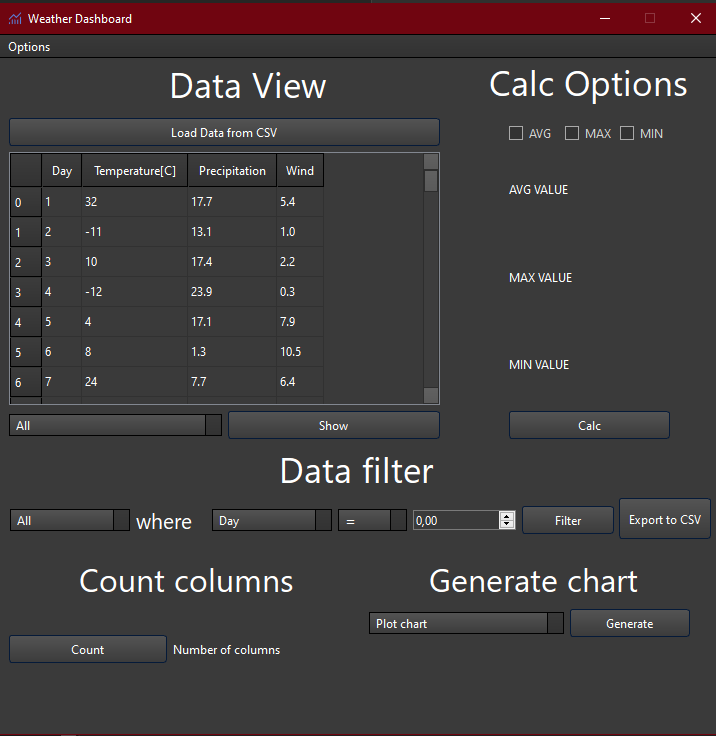
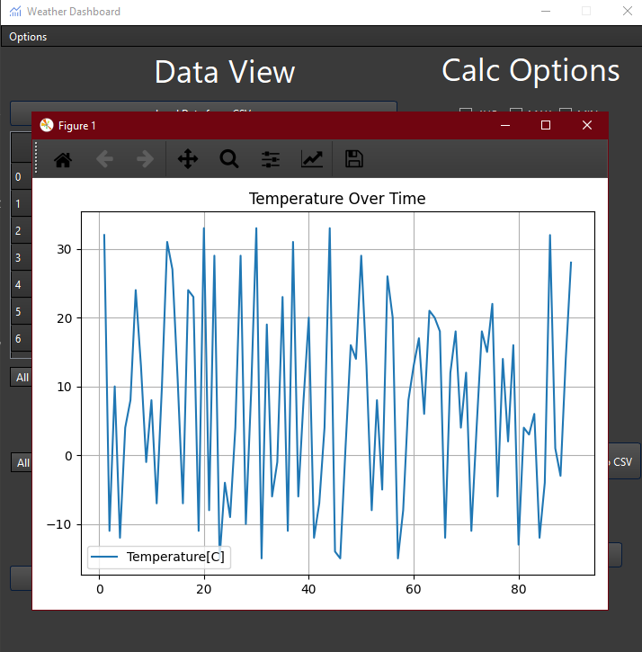
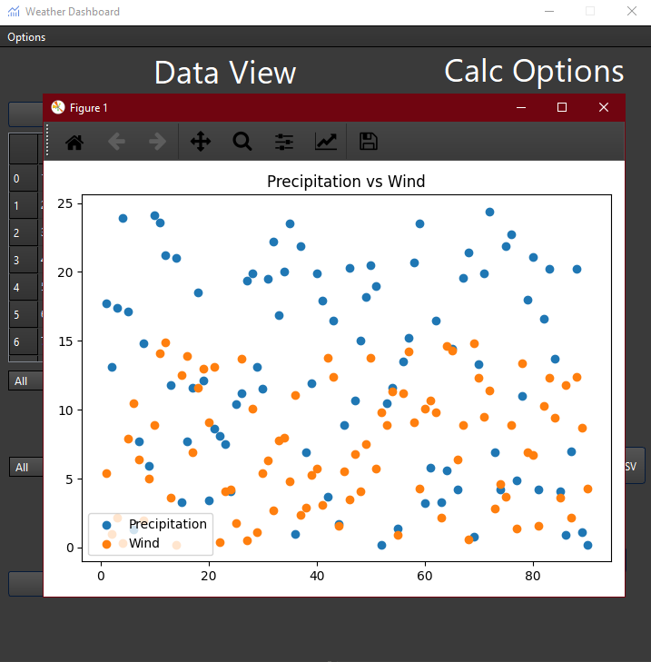
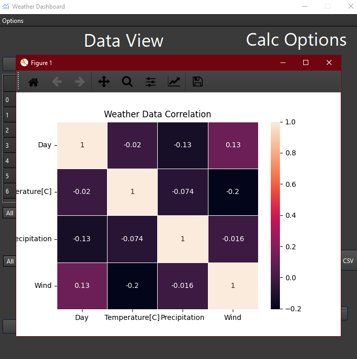

# Weather Dashboard

A desktop application for weather data analysis and visualization built with PySide6 (Qt for Python) with matplotlib and seaborn integration.

## 📸 Screenshots

### Main Interface


*Main application window with loaded weather data*

### Data Visualization Examples


*Temperature trends over time*



*Correlation analysis between wind and precipitation*



*Correlation matrix visualization of all weather parameters*

## 📋 Description

Weather Dashboard is a CSV data analysis tool specifically designed for working with weather data. The application provides an intuitive graphical interface for loading, filtering, statistical analysis, and data visualization through various chart types.

## ✨ Features

### 📊 Data Management
- **CSV File Loading** - Import data from CSV files (optimized for Polish Excel version with `;` separator)
- **Automatic Format Conversion** - Convert commas to dots in numerical data
- **Data Preview** - Display data in tables with automatic column sizing
- **Data Export** - Save filtered data to CSV files
- **Sample Data Generation** - Built-in script to generate realistic weather data for testing

### 🔍 Filtering and Analysis
- **Column Filtering** - Display individual columns or all data
- **Advanced Filtering** - Filter data by values with operators:
  - `=` (equal)
  - `>` (greater than)
  - `<` (less than)
  - `≥` (greater or equal)
  - `≤` (less or equal)
  - `≠` (not equal)

### 📈 Statistical Analysis
- **Average Values** - Calculate arithmetic mean
- **Extreme Values** - Find maximum and minimum values
- **Data Counting** - Count non-empty values in columns
- **Analysis for entire dataset** or selected columns

### 📊 Data Visualization
The application offers three types of charts:

1. **Line Chart (Plot Chart)**
   - Single and multi-line plots
   - Configurable X and Y axes
   - Optional legend and grid
   - Custom axis labels and titles

2. **Scatter Chart**
   - Compare two variables
   - Option to add second data series
   - Configurable legends and grids

3. **Heatmap**
   - Visualize correlations between numerical variables
   - Different color palettes
   - Annotations with correlation values

### 🎨 Customization
- **Interface Themes** - Light and dark themes
- **Responsive Interface** - Automatic element adjustment
- **Error Highlighting** - Visual indication of invalid operations

## 🛠️ Technical Requirements

### Required Python Libraries:
```
pandas >= 1.3.0
PySide6 >= 6.0.0
matplotlib >= 3.4.0
seaborn >= 0.11.0
numpy >= 1.21.0
```

### Project Structure:
```
CSV_Weather_Dashboard/
├── Weather_Dashboard/
│   ├── WeatherDashboard.py          # Main application file
│   ├── TableModel.py                # Data model for table
│   ├── GenerateHeatmapChartDialog.py # Heatmap dialog
│   ├── GeneratePlotChartDialog.py   # Line chart dialog
│   ├── GenerateScatterChartDialog.py # Scatter chart dialog
│   ├── EmptyDatadrameDialog.py      # Empty data warning dialog
│   └── WarningDialog.py             # General warning dialog
├── Qt_Designer/
│   ├── mainwindow.ui                # Qt Designer interface file
│   ├── emptydataframe.ui            # Empty data dialog UI
│   ├── heatmapchartdialog.ui        # Heatmap dialog UI
│   ├── plotchartdialog.ui           # Plot chart dialog UI
│   ├── scatterchartdialog.ui        # Scatter chart dialog UI
│   └── warning.ui                   # Warning dialog UI
├── Stylesheet/
│   ├── Combinear.qss                # Dark theme
│   ├── Combinear.png                # Dark theme assets
│   ├── Integrid.qss                 # Light theme
│   └── Integrid.png                 # Light theme assets
├── Data/
│   └── Weather_data.csv             # Sample weather data
├── Simulating_Data/
│   └── Simulating_Data.py           # Data generation script
├── Icons/                           # Application icons
└── README.md
```

## 🚀 Installation and Setup

1. **Clone the repository:**
```bash
git clone https://github.com/bb305496/CSV_Weather_Dashboard.git
cd weather-dashboard
```

2. **Install dependencies:**
```bash
pip install pandas PySide6 matplotlib seaborn numpy
```

3. **Generate sample data (optional):**
```bash
cd Simulating_Data
python Simulating_Data.py
```

4. **Run the application:**
```bash
cd Weather_Dashboard
python WeatherDashboard.py
```

## 💡 Usage Instructions

1. **Load Data** - Click "Load CSV" and select your data file
2. **Browse Data** - Use column filters to explore your data
3. **Analyze Statistics** - Select checkboxes for average, max, min and click "Calculate"
4. **Filter Data** - Set filtering criteria in the lower section
5. **Generate Charts** - Choose chart type and configure parameters
6. **Export Results** - Save filtered data to CSV

## 🎯 Use Cases

- **Meteorological Data Analysis** - Temperature, humidity, pressure
- **Environmental Monitoring** - Air quality, noise levels
- **Time Series Analysis** - Trends and patterns in data
- **Scientific Research** - Exploratory data analysis
- **Education** - Learning data analysis and visualization

## 🔧 Sample Data Generation

The project includes a data generation script that creates realistic weather data for testing purposes:

**Features of the data generator:**
- Generates 90 days of weather data
- **Temperature**: Random values between -15°C and 34°C
- **Precipitation**: Random values between 0 and 24mm
- **Wind Speed**: Random values between 0 and 14 m/s
- Uses numpy seed for reproducible results
- Outputs CSV format compatible with the application

**To generate new sample data:**
```bash
cd Simulating_Data
python Simulating_Data.py
```

The generated file will be saved as `Weather_data.csv` in the `Data/` directory and can be immediately loaded into the application.

## 🧰 Technologies Used

This project leverages the following technologies and libraries:

- **Python** – Core programming language used for application logic and data processing  
- **PySide6 (Qt for Python)** – GUI framework for building the desktop interface  
- **Pandas** – Data manipulation and analysis library for handling CSV and numerical data  
- **NumPy** – Numerical computing library for data generation and preprocessing  
- **Matplotlib** – Plotting library used for line charts and scatter plots  
- **Seaborn** – Statistical data visualization library used primarily for heatmaps  
- **Qt Designer** – Visual design tool for creating `.ui` interface files  
- **QSS (Qt Style Sheets)** – Custom styling for light and dark themes  
- **CSV File Handling** – For importing and exporting weather data  


## 🔧 Future Enhancements
- Pie Charts
- Area Plots
- Bar Graphs
- Histograms
- Box Plots

## 📝 Technical Notes

- Application supports Polish localization (`;` separator in CSV)
- Automatic conversion of commas to dots in numerical data
- Error handling with visual feedback
- Responsive interface with dynamic data loading

## 🤝 Contributing

I welcome:
- Bug reports (Issues)
- Feature requests
- Pull requests with improvements
- Interface translations

## 📦 Changelog

### [1.1.0] – 02.06.2025
- Add Blue-Dark, Green-Blue and Purple themes
- Add open and save data options to menu bar
- Improve file saving function
- Add generating heatmap with filtered data
- Add area plot chart

### [1.0.0] – 01.06.2025
- Initial release

## 📄 License

This project is licensed under the MIT License. See the `LICENSE` file for details.

---

**Author:**  bb305496  
**Contact:**  barb305496@gmail.com  
**Version:** 1.1.0

